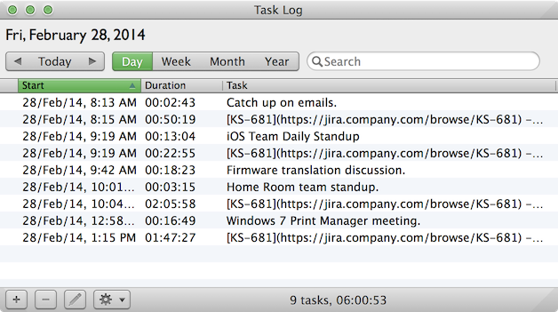
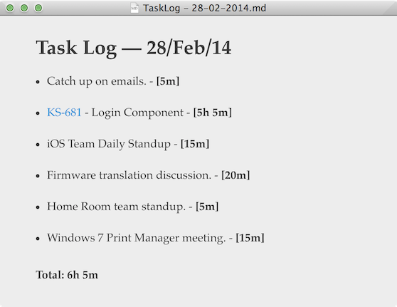

TaskLogToMDReport
=================

Converts a [TaskLog](http://fat-apps.com/tasklog-mac/) export CSV file into a simple Markdown report.

[TaskLog](http://fat-apps.com/tasklog-mac/) is a very cool task tracking app by [Fat Apps](http://fat-apps.com/). Check it out!

**Export from this:**

**to this:**

_Note: As of version 1.1.0, time percentages are included in the report._

_This is very early-release software, and may contain unknown bugs._

__Known limitations include:__

- ~~Currently only compatible with TaskLog's Export duration format "00:00:00".~~ **Fixed by zpasternack. Thanks!!**
- Report task duration times are rounded, and there is currently no option to use exact durations.
- Report task duration times are hour and minute only, with no option to display seconds.
- The resulting Markdown report format is static; no templating support.
- Tasks with the same name are grouped in the report, and their durations are aggregated. Currently there is not an option to disable this.
- No option to output usage.

__Usage:__

`> tasklog2md [-d] exportFile.csv [-o outputFile.md]`

The resulting file can be opened in a Markdown-compatible viewer or editor, and converted to any other suitable format, such as PDF. The reports can also be archived, shared with collaborators, etc.

The -d option will remove the source file after successful conversion to markdown.

`> tasklog2md -v`

Display version.
